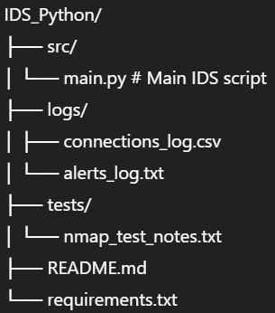

# IDS Python – Intrusion Detection System

## Project Overview

This project aims to build a lightweight Intrusion Detection System (IDS) in Python that can:

- Monitor real-time network traffic
- Detect suspicious behavior (e.g., port scans, brute-force attacks)
- Generate alerts upon detecting intrusions
- Log connection and alert data for future analysis

## Tools & Libraries

- **Scapy** – packet capture and network inspection
- **Sockets** – for low-level network communication (planned)
- **Threading** – to support real-time, multi-connection environments (optional)
- **CSV logging** – to store connection and alert records
- (Upcoming) **Pandas** – for log analysis and reporting

## Implemented Features

- [x] Real-time capture of TCP and UDP packets
- [x] Connection logging to `logs/connections_log.csv`
- [x] Port scan detection (15+ different ports in <10s)
- [x] Brute-force detection on sensitive ports (10+ attempts)
- [x] Alert system (printed to console + saved in `alerts_log.txt`)
- [ ] Email alert notifications (planned)
- [ ] CLI menu or visual reporting (planned)

## Project Structure

## 🧪 Testing Plan

- Simulate port scans using `nmap`
- Simulate brute-force attacks using `hydra` or custom scripts
- Evaluate detection thresholds (true/false positives)

## 📆 Timeline

- ✅ Base prototype: Completed (May 2025)
- 🔄 Detection rules + alerts: In progress
- ⏳ Log analysis & reporting: Planned (June 2025)
- 📝 Final documentation and submission: By July 5, 2025

## 👥 Authors

- Emo Solène
- Wu Bang-Guo
